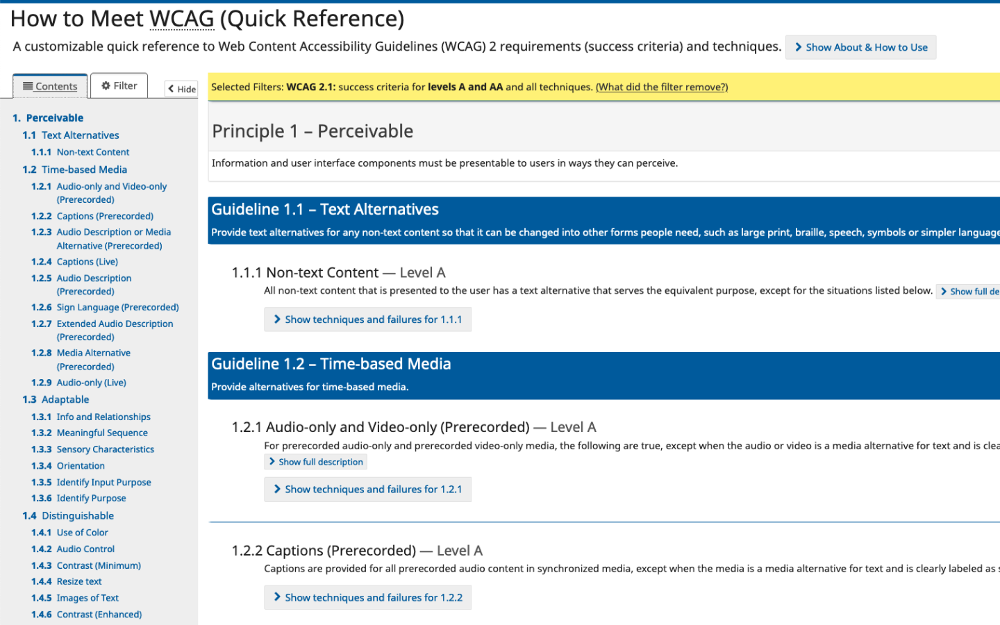

<section>

# **Accessibility Testing 101**

</section>

<section>

# The Standard

[WCAG 2.1 AA](https://www.w3.org/WAI/WCAG21/quickref/?currentsidebar=%23col_customize&levels=aaa)

</section>

<section>

</section>

<section>

</section>

<section>

# The Goal

</section>

<section  class="small">

“Following these guidelines will make content more accessible to a wider range of people with disabilities, including accommodations for **blindness** and **low vision**, **deafness** and **hearing loss**, **limited movement**, **speech disabilities**, **photosensitivity**, and **combinations** of these, and some accommodation for **learning disabilities and cognitive limitations**, but will not address every user need for people with these disabilities... Following these guidelines will also often make Web content _**more usable to users in general.**_”

[WCAG 2.1 Abstract](https://www.w3.org/TR/WCAG21/#abstract-0)

</section>

<section>

# In Practice

</section>

<section>

## 1. Use color that passes **contrast&nbsp;ratios**

_Low vision, blindness_

</section>

<section>

## 2. **Zoom the browser** up to 200%

_Low vision, blindness_

</section>

<section>

## 3. **Resize the browser** down to 320px

[(1.4.10 Reflow)](https://www.w3.org/WAI/WCAG21/Understanding/reflow.html)

_Low vision, blindness_

</section>

<section>

## 4. Try using just a **keyboard**

_Limited movement, low vision, blindness_

</section>

<section>

## 5. Try using just a **screenreader**

_Limited movement, low vision, blindness_

</section>

<section>

# In Summary

</section>

<section>

1. Contrast ratios
2. Zoom
3. Resize
4. Keyboard
5. Screenreader

</section>

<section>

By testing those things on each story, you will catch the vast majority of issues, without having to constantly read WCAG.

_Use WCAG for edge cases and questions_

</section>

<section>

# How to use VoiceOver

<footer>

[Quick VoiceOver Tutorial Video](https://www.youtube.com/watch?v=5R-6WvAihms)

_Note: VoiceOver is not the most commonly-used screenreader, but something is better than nothing_

</footer>

</section>

<section>

**Turn Voiceover On/Off**

# ⌘ + F5

</section>

<section>

**Voiceover Modifier (Screenreader Tab)**

# Control + option

</section>

<section>

**Basic Navigation**

# _Control + option_   + [arrow]

</section>

<section>

**Click on things**

# _Control + option_   + space

</section>

<section>

**Navigate by headings**

# _Control + option_   + ⌘ + H

</section>

<section>

**Stop voiceover from talking**

# Control

</section>
