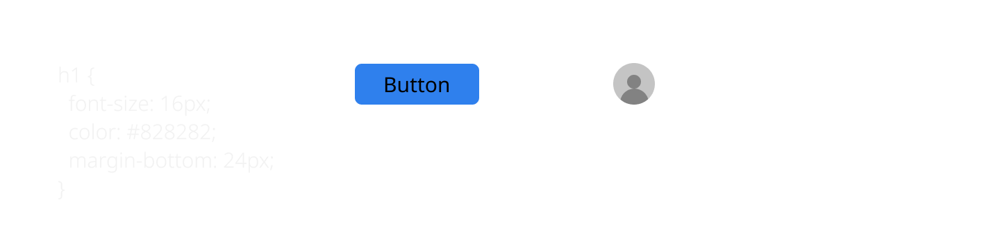

<section>

## Design Tokens

Style once, use everywhere

</section>

<section>

## What are tokens?

Single values that are the atoms and building blocks of a design system

</section>

<section>

```scss
$Primary-Color: #2f80ed;
$Body-Font-Size: 16px;
$Medium-Space: 24px;
```

</section>

<section>

## What tokens are <em>not</em>

A library of components, a composite of mixed values, or molecule-level type things

</section>

<section>



</section>

<section>

## Why are they useful?

They allow you to have a single source of flexible, consistently-named design values that can be easily shared between design and dev across projects and platforms.

</section>

<section data-auto-animate>

## Life without tokens

  <div class="tw-grid tw-grid-cols-2">
  <div>
  <ul>
    <li>
    <span class="tw-inline-block tw-bg-gray-100 tw-h-8 tw-w-8 tw-rounded"></span> Gray 100
    </li>
    <li>
    <span class="tw-inline-block tw-bg-gray-200 tw-h-8 tw-w-8 tw-rounded"></span> Gray 200
    </li>
    <li>
    <span class="tw-inline-block tw-bg-gray-400 tw-h-8 tw-w-8 tw-rounded"></span> Gray 300
    </li>
    <li>
    <span class="tw-inline-block tw-bg-gray-500 tw-h-8 tw-w-8 tw-rounded"></span> #4F4F4F
    </li>
    <li>
    <span class="tw-inline-block tw-bg-blue-500 tw-h-8 tw-w-8 tw-rounded"></span> Blue 500
    </li>
    <li>
    <span class="tw-inline-block tw-bg-red-400 tw-h-8 tw-w-8 tw-rounded"></span> Red 300
    </li>
  </ul>
  </div>
  <div>

<pre data-id="code-animation"><code data-trim data-line-numbers>
// color-tokens.scss

$lighter-gray: #e0e0e0;
$light-gray: #bdbdbd;
$medium-gray: #828282;
$dark-gray: #4f4f4f;
$blue-500: #2f80ed;
$red-300: #2f80ed;
</code></pre>

  </div>
</div>

</section>

<section data-auto-animate>

## Life without tokens

<div class="tw-grid tw-grid-cols-2">
<div>
<ul>
  <li>
  <span class="tw-inline-block tw-bg-gray-100 tw-h-8 tw-w-8 tw-rounded"></span> Gray 100
  </li>
  <li>
  <span class="tw-inline-block tw-bg-gray-200 tw-h-8 tw-w-8 tw-rounded"></span> Gray 200
  </li>
  <li class="tw-bg-white tw-bg-opacity-10">
  <span class="tw-inline-block tw-bg-gray-300 tw-h-8 tw-w-8 tw-rounded"></span> Gray 250??
  </li>
  <li>
  <span class="tw-inline-block tw-bg-gray-400 tw-h-8 tw-w-8 tw-rounded"></span> Gray 300
  </li>
  <li>
  <span class="tw-inline-block tw-bg-gray-500 tw-h-8 tw-w-8 tw-rounded"></span> #4F4F4F
  </li>
  <li class="tw-line-through tw-opacity-50">
  <span class="tw-inline-block tw-bg-blue-500 tw-h-8 tw-w-8 tw-rounded"></span> Blue 500
  </li>
  <li class="tw-bg-white tw-bg-opacity-10">
  <span class="tw-inline-block tw-bg-purple-500 tw-h-8 tw-w-8 tw-rounded"></span> Purple 500
  </li>
  <li>
  <span class="tw-inline-block tw-bg-red-400 tw-h-8 tw-w-8 tw-rounded"></span> Red 300
  </li>
</ul>
</div>
<div>

<pre data-id="code-animation"><code data-trim data-line-numbers>
// color-tokens.scss

$lighter-gray: #e0e0e0;
$light-gray: #bdbdbd;
$medium-gray: #828282;
$mediumer-gray: #b3aaaa;//???
$dark-gray: #4f4f4f;
$blue-500: #9b51e0;//purple
$red-300: #2f80ed;
</code></pre>
</div>
</div>

</section>

<section data-auto-animate>

## Life with tokens

<div class="tw-grid tw-grid-cols-2">
<div>
<ul>
  <li>
  <span class="tw-inline-block tw-bg-gray-100 tw-h-8 tw-w-8 tw-rounded"></span> Bg Light
  </li>
  <li>
  <span class="tw-inline-block tw-bg-gray-600 tw-h-8 tw-w-8 tw-rounded"></span> Bg Dark
  </li>
  <li>
  <span class="tw-inline-block tw-bg-blue-500 tw-h-8 tw-w-8 tw-rounded"></span> Action
  </li>
  <li>
  <span class="tw-inline-block tw-bg-red-400 tw-h-8 tw-w-8 tw-rounded"></span> Error
  </li>
</ul>
</div>
<div>

<pre data-id="code-animation"><code data-trim data-line-numbers>
// color-tokens.scss
$bg-light: #e0e0e0;
$bg-dark: #333333;
$action: #2f80ed;
$error: #2f80ed;
</code></pre>

</div>
</div>

</section>

<section data-auto-animate>

## Life with tokens

<div class="tw-grid tw-grid-cols-2">
<div>
<ul>
  <li>
  <span class="tw-inline-block tw-bg-gray-100 tw-h-8 tw-w-8 tw-rounded"></span> Bg Light
  </li>
  <li>
  <span class="tw-inline-block tw-bg-gray-600 tw-h-8 tw-w-8 tw-rounded"></span> Bg Dark
  </li>
  <li class="tw-line-through tw-opacity-50">
  <span class="tw-inline-block tw-bg-blue-500 tw-h-8 tw-w-8 tw-rounded"></span> Action
  </li>
  <li>
  <span class="tw-inline-block tw-bg-purple-500 tw-h-8 tw-w-8 tw-rounded"></span> Action
  </li>
  <li>
  <span class="tw-inline-block tw-bg-red-400 tw-h-8 tw-w-8 tw-rounded"></span> Error
  </li>
</ul>
</div>
<div>

<pre data-id="code-animation"><code data-trim data-line-numbers>
// color-tokens.scss
$bg-light: #e0e0e0;
$bg-dark: #333333;
$action: #9B51E0;//name remains
$error: #2f80ed;
</code></pre>

</div>
</div>

</section>

<section>

## How do you share tokens across design and dev?

</section>

<section>

## Single-Platform

</section>
