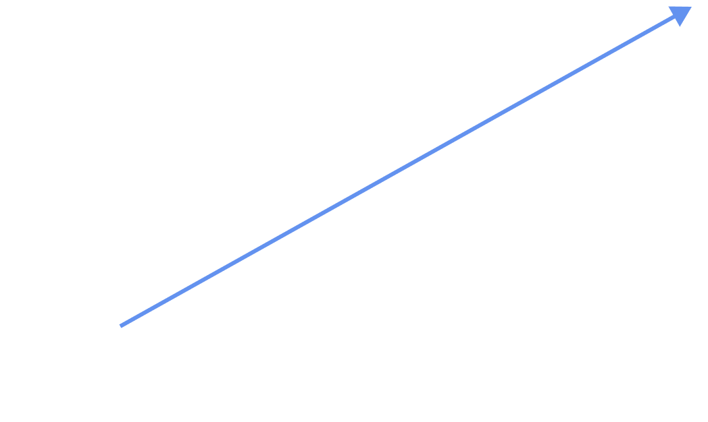

<section>

# Utility-first CSS

</section>

<section  data-transition="fade">

## Classic CSS Approach

```html
<div class="avatar">
  
  <p class="avatar__name">Grag Creft</p>
  <p class="avatar__title">Code Boy</p>
</div>
```

</section>

<section data-transition="fade">

## Utility First Approach

```html
<div class="p-4 text-black text-center">
  
  <p class="mt-2 text-base">Grag Creft</p>
  <p class="mt-2 text-sm text">Code Boy</p>
</div>
```

</section>

<section data-background-image="https://media.giphy.com/media/d10dMmzqCYqQ0/giphy.gif">
</section>

<section data-background-image="https://media.giphy.com/media/xT0xeJpnrWC4XWblEk/giphy.gif">
</section>

<section>

## Utility <em class="tw-text-rjs-action">first</em> not utility <em class="tw-text-rjs-action">only</em>

</section>

<section>

“Utility-first isn’t about ditching components altogether. It means you <strong class="tw-text-rjs-action">should start off with utility classes</strong>, make the most of them, and <strong class="tw-text-rjs-action">only abstract when you see repeating patterns</strong>. You’re allowing your project to grow while remaining flexible, and identify actual components over time, when patterns start to emerge.”

<em class="tw-text-base">From [In Defense of Utility-first CSS](https://frontstuff.io/in-defense-of-utility-first-css) by Sarah Dayan</em>

</section>

<section>

## Classic CSS Approach



</section>
